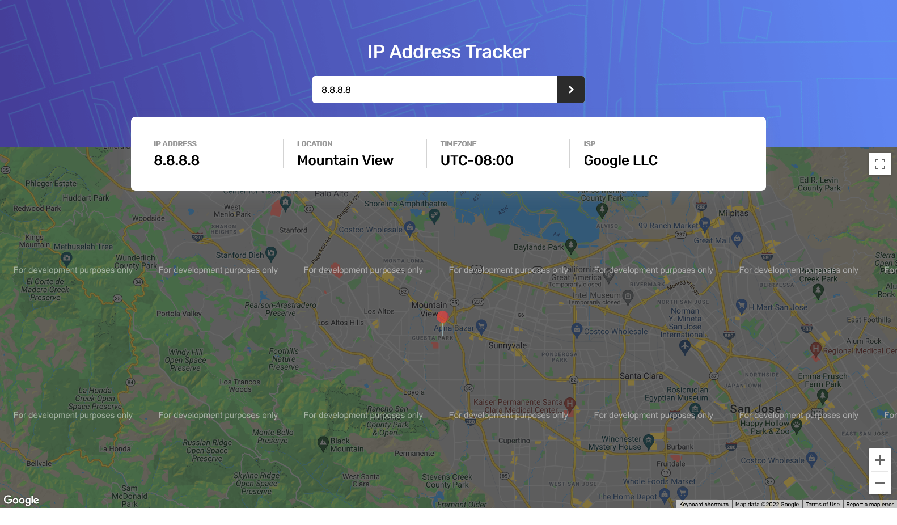
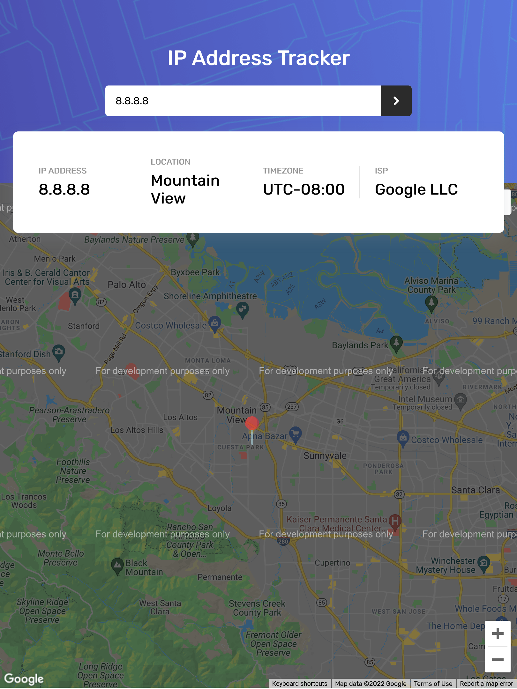
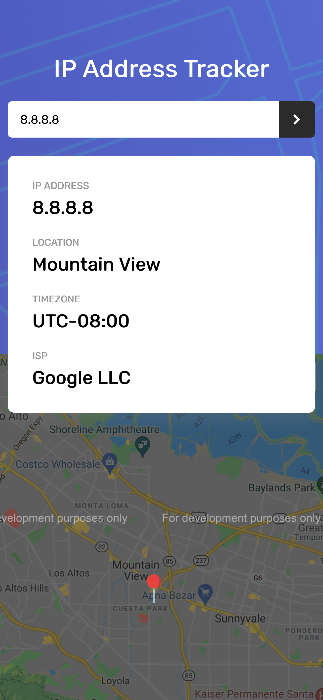

# Frontend Mentor - IP address tracker solution

This is a solution to the [IP address tracker challenge on Frontend Mentor](https://www.frontendmentor.io/challenges/ip-address-tracker-I8-0yYAH0). Frontend Mentor challenges help you improve your coding skills by building realistic projects.

## Overview

### The challenge

Users should be able to:

- See their own IP address on the map on the initial page load
- Search for any IP addresses or domains and see the key information and location

### Screenshot

### Links

- [Github URL](https://github.com/densec/ip-address-tracker)
- [Live Demo](https://your-live-site-url.com)

## My process

### Built with

- Semantic HTML5 markup
- CSS custom properties
- Flexbox
- CSS Grid
- Mobile-first workflow
- [React](https://reactjs.org/) - JS library
- [Styled Components](https://styled-components.com/) - For styles

## Author

- Website - [anandca](https://www.anandca.live)
- Frontend Mentor - [@densec](https://www.frontendmentor.io/profile/densec)
